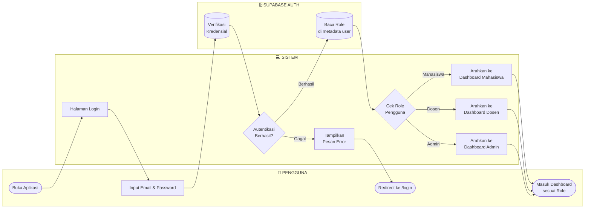
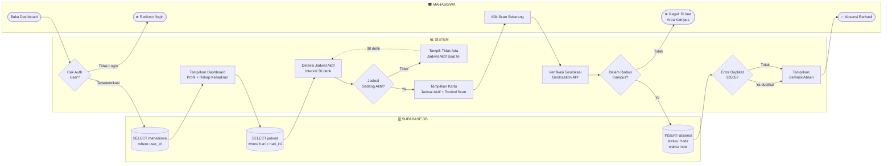
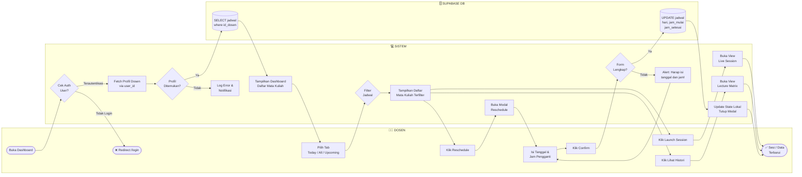
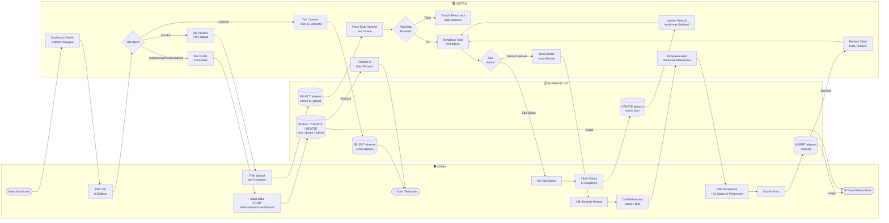

# Activity Diagram Swimlane — Sistem Informasi Absensi (SI-ABSENSI)

> Setiap diagram menggunakan **swimlane** (subgraph per aktor) dengan arah alur kiri → kanan.
> Dapat di-render di [Mermaid Live](https://mermaid.live) atau GitLab/GitHub markdown.

---

## Diagram 1: Alur Login & Role Routing

---

## Diagram 2: Alur Mahasiswa — Absensi Kuliah

---

## Diagram 3: Alur Dosen — Manajemen Sesi Kuliah

---

## Diagram 4: Alur Admin — Koreksi & Manajemen Data

